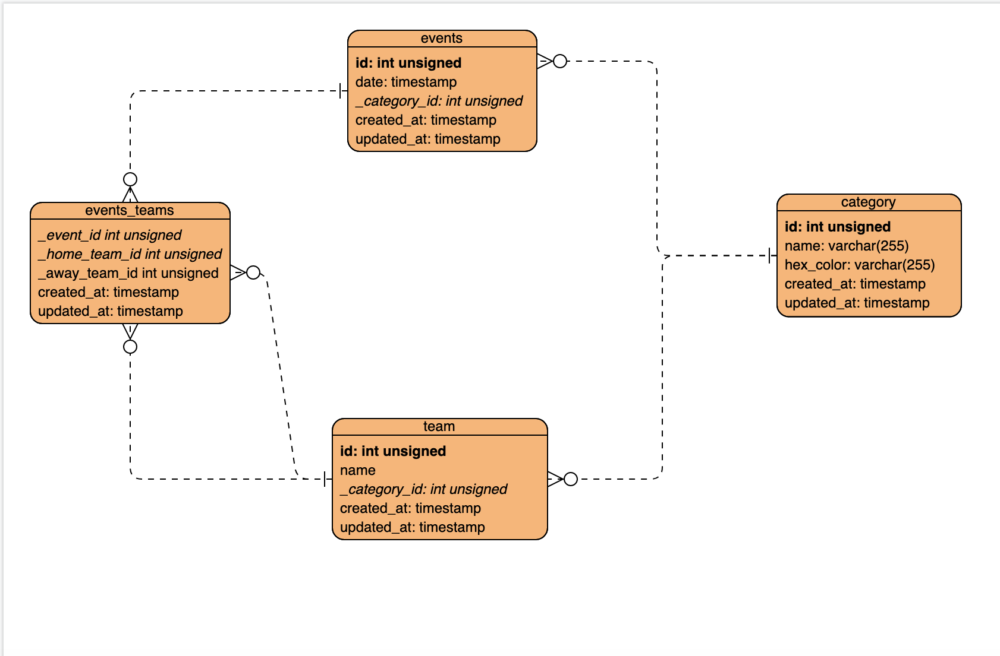

## **Sport event calendar**

A calendar to show, add, edit and filter sport events.

**How to run:**
Before running the project:
 - To run server:
	 - Go to server folder 
	 - Run `composer install`
	 - Run `composer start`
 - To run client
	 - Open index.html in web-client folder 

**MYSQL :**
MYSQL scripts can be found in `server/data` folder

**ERD of the system:**
